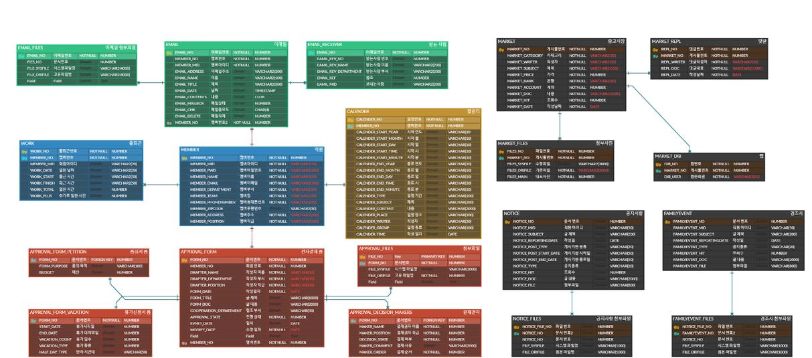
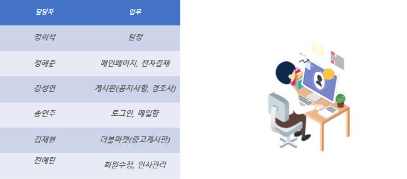
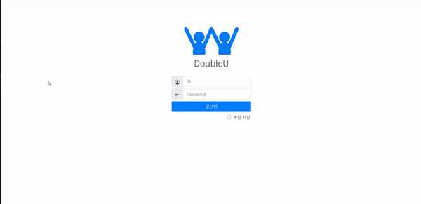

# 목차
- [목차](#목차)
- [1. 프로젝트 소개](#1-프로젝트-소개)
  - [1.1. 프로젝트 명](#11-프로젝트-명)
  - [1.2. 주제 선정 이유](#12-주제-선정-이유)
  - [1.3. 프로젝트 목표](#13-프로젝트-목표)
  - [1.4. 수행기간](#14-수행기간)
  - [1.5. 사용 기술](#15-사용-기술)
  - [1.4. ERD](#14-erd)
  - [1.5. 멤버별 기능 구현](#15-멤버별-기능-구현)
  - [1.6. 담당 역할](#16-담당-역할)
- [2. 기능 구현 상세 설명](#2-기능-구현-상세-설명)
  - [2.1. 로그인/로그아웃](#21-로그인로그아웃)
    - [2.1.1 코드 링크](#211-코드-링크)

# 1. 프로젝트 소개

## 1.1. 프로젝트 명
- `Double U`

[목차로 이동하기](#목차)
## 1.2. 주제 선정 이유

파이널 프로젝트에서는 CRUD 게시판을 기본으로 추가적인 다양한 기능을 구현 하고 싶었다. 마침 팀원 한 분께서 그룹웨어를 추천했다. 내가 전에 일했던 곳에서 다우 오피스의 그룹웨어를 사용했었고, UI가 깔끔하고 색감이 예뻐 마음에 들었다. 그래서 다우 오피스를 참고사이트로 의견을 냈다.

- 참고 사이트 : `다우오피스`, `더존ICT그룹`

[목차로 이동하기](#목차)

## 1.3. 프로젝트 목표
- 다양한 기능들을 갖춘 그룹웨어 개발

[목차로 이동하기](#목차)

## 1.4. 수행기간
- 2021년 01월 21일 ~ 2021년 03월 04일

[목차로 이동하기](#목차)

## 1.5. 사용 기술 

구분|종류|적용부분
|:-:|:-:|:-:|
|OS|window 10|공통|
|언어|Java, HTML, CSS, JavaScript|　|
|Database|Oracle Database 11gXE|공통|
|형상관리|git, sourceTree|공통|
|Editor tools |VSC|front-end|
|　|Eclipse EE, Spring Tool Suite|back-end 공통|
|　|Oracle SQL Developer |공통|
|Framework|ajax|공통|
|　|spring boot|공통|
|　|mybatis|공통
|　|bootstrap|front-end
|Library|jQuery, OJDBC, COS, JSTL|CRUD|
|Server|Tomcat Apache 9.0 |　|
|외부 API| daum 우편 API|사원 정보|
|　|Editor API| 게시판

[목차로 이동하기](#목차)

## 1.4. ERD 

[목차로 이동하기](#목차)

## 1.5. 멤버별 기능 구현
> 프로젝트 인원 : 6명

- 사내 공지 게시판
- 중고 게시판
- 메일함
- 조직도, 출퇴근
- 캘린더
- 전자결재

[목차로 이동하기](#목차)

## 1.6. 담당 역할

- 회의록 작성
- 로그인/로그아웃
- 메일함

[목차로 이동하기](#목차)

# 2. 기능 구현 상세 설명

> 메일함 공통적 요소
- 왼쪽 사이드바 count 이용하여 받은 메일함의 갯수를 표시하였다.
- 메일함을 클릭하면 전체선택, 스팸차단, 답장하기, 삭제하기, 전달하기, 읽음표시, 이동하기 버튼이 있다.
- 검색창을 이용하여 검색할 수 있다.
- 페이징 처리

## 2.1. 로그인/로그아웃

- member 테이블의 데이터가 일치하지 않을 시에 `alert`창을 띄어 재로그인 하도록 만들었다.
  - `alert`창은 SweetAlert을 기본으로 사용하였으나 해당 프로젝트의 색감과 일치하도록 css를 수정하여 적용하였다.
  - [SweetAlert 사이트](https://sweetalert.js.org/guides/)
- 로그인 성공 시 `HttpSession`에 해당 멤버의 데이터를 저장한다.
- 로그아웃 시 해당 세션을 `session.invalidate()` 초기화한다.

### 2.1.1 코드 링크

`view`
- [login.jsp](https://github.com/withColinSong/DoubleU/blob/main/doubleu/src/main/webapp/WEB-INF/jsp/MainPage/login.jsp)
- [loginPost.jsp `로그인 실패 스크립트와 view`](https://github.com/withColinSong/DoubleU/blob/main/doubleu/src/main/webapp/WEB-INF/jsp/MainPage/loginPost.jsp)
- [login.js `아이디/비밀번호을 입력하지 않았을 때 스크립트`](https://github.com/withColinSong/DoubleU/blob/main/doubleu/src/main/resources/static/js/login/login.js) 
- [login.css](https://github.com/withColinSong/DoubleU/blob/main/doubleu/src/main/resources/static/css/email/login.css)

`controller`
- [LoginURLController](https://github.com/withColinSong/DoubleU/blob/main/doubleu/src/main/java/com/doubleu/login/controller/loginURLController.java)
- [LoginMainController](https://github.com/withColinSong/DoubleU/blob/main/doubleu/src/main/java/com/doubleu/login/controller/loginMainController.java)

`vo`
- [LoginVo](https://github.com/withColinSong/DoubleU/blob/main/doubleu/src/main/java/com/doubleu/login/vo/LoginVo.java)

`Spring boot`
- [LoginDao `Dao`](https://github.com/withColinSong/DoubleU/blob/main/doubleu/src/main/java/com/doubleu/login/mybatis/LoginDao.java)
- [LoginService `Service`](https://github.com/withColinSong/DoubleU/blob/main/doubleu/src/main/java/com/doubleu/login/service/LoginService.java)
- [LoginMapper `Mapper`](https://github.com/withColinSong/DoubleU/blob/main/doubleu/src/main/java/com/doubleu/login/mybatis/LoginMapper.java)
- [myBatis `쿼리문`](https://github.com/withColinSong/DoubleU/blob/main/doubleu/src/main/resources/static/mapper/email_mapper.xml)

