# 목차
- [목차](#목차)
- [1. 프로젝트 소개](#1-프로젝트-소개)
  - [1.1. 프로젝트 명](#11-프로젝트-명)
  - [1.2. 주제 선정 이유](#12-주제-선정-이유)
  - [1.3. 프로젝트 목표](#13-프로젝트-목표)
  - [1.4. 수행기간](#14-수행기간)
  - [1.5. 사용 기술](#15-사용-기술)
  - [1.4. ERD](#14-erd)
  - [1.5. 멤버별 기능 구현](#15-멤버별-기능-구현)
  - [1.6. 담당 역할](#16-담당-역할)
- [2. 기능 구현 상세 설명](#2-기능-구현-상세-설명)
  - [2.1. 전체 선택](#21-전체-선택)
    - [2.1.1. 코드 링크](#211-코드-링크)
  - [2.2 스팸 차단](#22-스팸-차단)
    - [2.2.1 코드 링크](#221-코드-링크)
  - [2.3. 답장하기](#23-답장하기)
    - [2.3.1 코드 링크](#231-코드-링크)
  - [2.4. 삭제하기](#24-삭제하기)
    - [2.4.1. 코드 링크](#241-코드-링크)
  - [2.5. 전달하기](#25-전달하기)
    - [2.5.1. 코드 링크](#251-코드-링크)
  - [2.6. 읽음 표시](#26-읽음-표시)
    - [2.6.1. 코드 링크](#261-코드-링크)
  - [2.7. 이동하기](#27-이동하기)
    - [2.7.1. 코드 링크](#271-코드-링크)
  - [2.8. 메일 쓰기](#28-메일-쓰기)
    - [2.8.1. 코드 링크](#281-코드-링크)
  - [2.9 임시 저장하기](#29-임시-저장하기)
    - [2.9.1. 코드 링크](#291-코드-링크)
  - [2.10. 메일 읽기](#210-메일-읽기)
    - [2.10.1 코드 링크](#2101-코드-링크)
  - [2.11. 주소록](#211-주소록)
    - [2.11.1 코드 링크](#2111-코드-링크)
  - [2.12. 로그인/로그아웃](#212-로그인로그아웃)
    - [2.12.1 코드 링크](#2121-코드-링크)
- [3. 프로젝트 후기](#3-프로젝트-후기)
  - [3.1. 앞으로의 방향성](#31-앞으로의-방향성)

# 1. 프로젝트 소개

## 1.1. 프로젝트 명
- `Double U`

[목차로 이동하기](#목차)
## 1.2. 주제 선정 이유

파이널 프로젝트에서는 CRUD 게시판을 기본으로 추가적인 다양한 기능을 구현 하고 싶었다. 마침 팀원 한 분께서 그룹웨어를 추천했다. 내가 전에 일했던 곳에서 다우 오피스의 그룹웨어를 사용했었고, UI가 깔끔하고 색감이 예뻐 마음에 들었다. 그래서 다우 오피스를 참고사이트로 의견을 냈다.

- 참고 사이트 : `다우오피스`, `더존ICT그룹`

[목차로 이동하기](#목차)

## 1.3. 프로젝트 목표
- 다양한 기능들을 갖춘 그룹웨어 개발

[목차로 이동하기](#목차)

## 1.4. 수행기간
- 2021년 01월 21일 ~ 2021년 03월 04일

[목차로 이동하기](#목차)

## 1.5. 사용 기술 

구분|종류|적용부분
|:-:|:-:|:-:|
|OS|window 10|공통|
|언어|Java, HTML, CSS, JavaScript|　|
|Database|Oracle Database 11gXE|공통|
|형상관리|git, sourceTree|공통|
|Editor tools |VSC|front-end|
|　|Eclipse EE, Spring Tool Suite|back-end 공통|
|　|Oracle SQL Developer |공통|
|Framework|ajax|공통|
|　|spring boot|공통|
|　|mybatis|공통
|　|bootstrap|front-end
|Library|jQuery, OJDBC, COS, JSTL|CRUD|
|Server|Tomcat Apache 9.0 |　|
|외부 API| daum 우편 API|사원 정보|
|　|Editor API| 게시판

[목차로 이동하기](#목차)

## 1.4. ERD 

[목차로 이동하기](#목차)

## 1.5. 멤버별 기능 구현
> 프로젝트 인원 : 6명

- 사내 공지 게시판
- 중고 게시판
- 메일함
- 조직도, 출퇴근
- 캘린더
- 전자결재

[목차로 이동하기](#목차)

## 1.6. 담당 역할

- 회의록 작성
- 로그인/로그아웃
- 메일함

[목차로 이동하기](#목차)

# 2. 기능 구현 상세 설명
> 메일함 구성
- 받은 메일함
- 중요 메일함
- 임시 보관함
- 보낸 메일함
- 스팸 메일함
- 휴지통
- 내 메일함

> 메일함 공통적 요소
- 왼쪽 사이드바 count 이용하여 받은 메일함의 갯수를 표시하였다.
- 메일함을 클릭하면 전체선택, 스팸차단, 답장하기, 삭제하기, 전달하기, 읽음표시, 이동하기 버튼이 있다.
- 검색창을 이용하여 검색할 수 있다.
- 페이징 처리

`공통 코드`
- [sidebar.jsp `왼쪽 사이드바`](https://github.com/withColinSong/DoubleU/blob/main/doubleu/src/main/webapp/WEB-INF/jsp/email/commonsCode/emailSidebarLink.jsp)

[목차로 이동하기](#목차)

## 2.1. 전체 선택

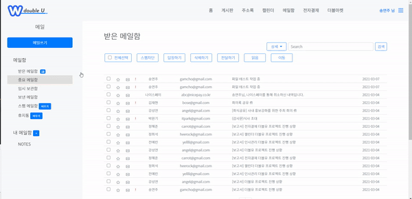

- 스크립트를 이용하여 `onclick` 이벤트시 `selectChkBox(this)` function을 주어, 체크박스의 `name`을 가지고 있는 체크박스를 체크하게 된다.

### 2.1.1. 코드 링크
`view`
- [email_index.jsp](https://github.com/withColinSong/DoubleU/blob/main/doubleu/src/main/webapp/WEB-INF/jsp/email/email_index.jsp)
- [email_commons.js](https://github.com/withColinSong/DoubleU/blob/main/doubleu/src/main/resources/static/js/email/email_commons.js)

[목차로 이동하기](#목차)

## 2.2 스팸 차단

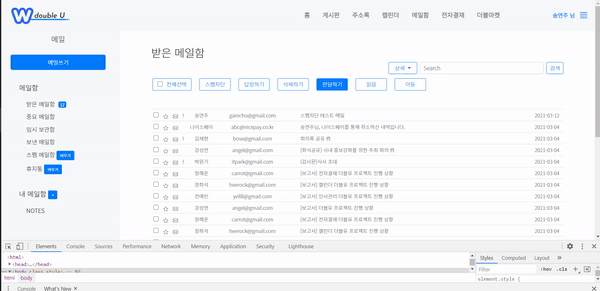

- 해당 체크박스를 클릭 후 스팸 차단 버튼을 누르면 모달창이 뜨고, 차단하기 버튼을 누르면 해당 메일이 스팸 메일함으로 이동된다.

### 2.2.1 코드 링크
`view`
- [email_index.jsp](https://github.com/withColinSong/DoubleU/blob/main/doubleu/src/main/webapp/WEB-INF/jsp/email/email_index.jsp)
- [email_spam.jsp](https://github.com/withColinSong/DoubleU/blob/main/doubleu/src/main/webapp/WEB-INF/jsp/email/email_spam.jsp)
- [email_spam_modal.jsp](https://github.com/withColinSong/DoubleU/blob/main/doubleu/src/main/webapp/WEB-INF/jsp/email/modal/spamModal.jsp)
- [email_commons.js](https://github.com/withColinSong/DoubleU/blob/main/doubleu/src/main/resources/static/js/email/email_commons.js) 
- [email_main.css](https://github.com/withColinSong/DoubleU/blob/main/doubleu/src/main/resources/static/css/email/email_main.css)

`controller`
- [EmailMainController](https://github.com/withColinSong/DoubleU/blob/main/doubleu/src/main/java/com/doubleu/email/contorller/EmailMainController.java)
    - Ctrl+F -> `// 스팸 차단 모달`

`vo`
- [EmailVo](https://github.com/withColinSong/DoubleU/blob/main/doubleu/src/main/java/com/doubleu/email/vo/EmailMainVo.java)

`business logic`
- [EmailDao `Dao`](https://github.com/withColinSong/DoubleU/blob/main/doubleu/src/main/java/com/doubleu/email/mybatis/EmailDao.java)
  -  Ctrl+F -> `// 삭제하기`
- [EmailMapper `Mapper`](https://github.com/withColinSong/DoubleU/blob/3690e8823b4bec1da302f558812bdfc57182ce21/doubleu/src/main/java/com/doubleu/email/mybatis/EmailMapper.java)
  - Ctrl+F -> `// 삭제하기 , 이동하기`
- [MyBatis `쿼리문`](https://github.com/withColinSong/DoubleU/blob/main/doubleu/src/main/resources/static/mapper/email_mapper.xml)

[목차로 이동하기](#목차)

## 2.3. 답장하기

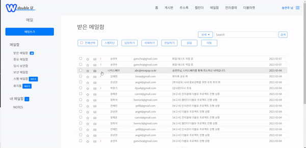

- 해당 체크박스를 클릭 후 답장하기 버튼을 누르면 메일 쓰기로 이동하며 해당 메일 주소가 받는 사람 목록에 추가된다.

### 2.3.1 코드 링크
`view`
- [email_writeReply.jsp](https://github.com/withColinSong/DoubleU/blob/main/doubleu/src/main/webapp/WEB-INF/jsp/email/email_writeReply.jsp)
- [email_commonsButton `답장하기 버튼, 스크립트`](https://github.com/withColinSong/DoubleU/blob/main/doubleu/src/main/webapp/WEB-INF/jsp/email/commonsCode/selectAllDropDowns.jsp) 
- [email_text.js `Editor API`](https://github.com/withColinSong/DoubleU/blob/main/doubleu/src/main/resources/static/js/email/email_text.js)
- [email_write.js](https://github.com/withColinSong/DoubleU/blob/main/doubleu/src/main/resources/static/js/email/email_write.js)
- [email_write.css](https://github.com/withColinSong/DoubleU/blob/main/doubleu/src/main/resources/static/css/email/email_write.css)

`controller`
- [EmailSelectController](https://github.com/withColinSong/DoubleU/blob/3690e8823b/doubleu/src/main/java/com/doubleu/email/contorller/EmailSelectController.java)
    - Ctrl+F -> `// 답장하기`

`vo`
- [EmailVo](https://github.com/withColinSong/DoubleU/blob/main/doubleu/src/main/java/com/doubleu/email/vo/EmailMainVo.java)

`business logic`
- [EmailDao `Dao`](https://github.com/withColinSong/DoubleU/blob/main/doubleu/src/main/java/com/doubleu/email/mybatis/EmailDao.java)
  -  Ctrl+F -> `replyWriteMail`
- [EmailFileUpload Service](https://github.com/withColinSong/DoubleU/blob/3690e8823b4bec1da302f558812bdfc57182ce21/doubleu/src/main/java/com/doubleu/email/service/EmailUploadService.java#L17)
- [EmailReveiver Service](https://github.com/withColinSong/DoubleU/blob/3690e8823b/doubleu/src/main/java/com/doubleu/email/service/EmailReveiverService.java)
- [EmailMapper `Mapper`](https://github.com/withColinSong/DoubleU/blob/3690e8823b4bec1da302f558812bdfc57182ce21/doubleu/src/main/java/com/doubleu/email/mybatis/EmailMapper.java)
  - Ctrl+F -> `replyWriteMail`
- [MyBatis `쿼리문`](https://github.com/withColinSong/DoubleU/blob/main/doubleu/src/main/resources/static/mapper/email_mapper.xml)

[목차로 이동하기](#목차)

## 2.4. 삭제하기
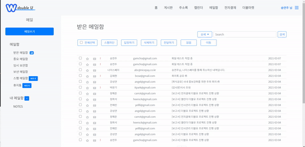
- 해당 체크박스를 클릭 후 삭제하기를 누르면 해당 메일은 영구적으로 삭제된다.

### 2.4.1. 코드 링크
`view`
- [email_index.jsp](https://github.com/withColinSong/DoubleU/blob/main/doubleu/src/main/webapp/WEB-INF/jsp/email/email_index.jsp)
- [email_delete_modal.jsp](https://github.com/withColinSong/DoubleU/blob/main/doubleu/src/main/webapp/WEB-INF/jsp/email/modal/deleteModal.jsp)
- [email_commons.js](https://github.com/withColinSong/DoubleU/blob/main/doubleu/src/main/resources/static/js/email/email_commons.js)
  - Ctrl+F -> `var DeleteBtn` 
- [email_main.css](https://github.com/withColinSong/DoubleU/blob/main/doubleu/src/main/resources/static/css/email/email_main.css)

`controller`
- [EmailMainController](https://github.com/withColinSong/DoubleU/blob/3690e8823b/doubleu/src/main/java/com/doubleu/email/contorller/EmailSelectController.java)
    - Ctrl+F -> `DeleteSendTrash`

`vo`
- [EmailVo](https://github.com/withColinSong/DoubleU/blob/main/doubleu/src/main/java/com/doubleu/email/vo/EmailMainVo.java)

`business logic`
- [EmailDao `Dao`](https://github.com/withColinSong/DoubleU/blob/main/doubleu/src/main/java/com/doubleu/email/mybatis/EmailDao.java)
  -  Ctrl+F -> `// 삭제하기`
- [EmailMapper `Mapper`](https://github.com/withColinSong/DoubleU/blob/3690e8823b4bec1da302f558812bdfc57182ce21/doubleu/src/main/java/com/doubleu/email/mybatis/EmailMapper.java)
  - Ctrl+F -> `updateSendTrash`
- [MyBatis `쿼리문`](https://github.com/withColinSong/DoubleU/blob/main/doubleu/src/main/resources/static/mapper/email_mapper.xml)

[목차로 이동하기](#목차)

## 2.5. 전달하기

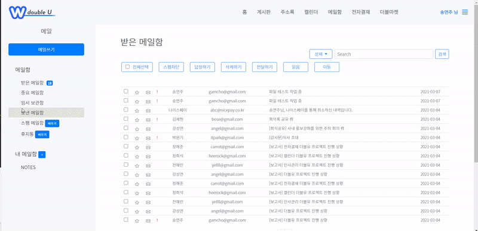
- 해당 체크박스를 클릭 후 전달하기 버튼을 누르면 메일 쓰기로 이동하며 해당 메일 주소가 받는 사람 목록에 추가되며 해당 메일에 `제목, 내용, 첨부파일`의 데이터를 가져와 덧붙여 작성할 수 있다.

### 2.5.1. 코드 링크
`view`
- [email_trans.jsp](https://github.com/withColinSong/DoubleU/blob/main/doubleu/src/main/webapp/WEB-INF/jsp/email/email_writeTrans.jsp)
- [email_commonsButton `전달하기 버튼, 스크립트`](https://github.com/withColinSong/DoubleU/blob/main/doubleu/src/main/webapp/WEB-INF/jsp/email/commonsCode/selectAllDropDowns.jsp)
- [email_text.js `Editor API`](https://github.com/withColinSong/DoubleU/blob/main/doubleu/src/main/resources/static/js/email/email_text.js)
- [email_write.js](https://github.com/withColinSong/DoubleU/blob/main/doubleu/src/main/resources/static/js/email/email_write.js)
- [email_write.css](https://github.com/withColinSong/DoubleU/blob/main/doubleu/src/main/resources/static/css/email/email_write.css)

`controller`
- [EmailSelectController](https://github.com/withColinSong/DoubleU/blob/3690e8823b/doubleu/src/main/java/com/doubleu/email/contorller/EmailSelectController.java)
    - Ctrl+F -> `// 전달하기`

`vo`
- [EmailVo](https://github.com/withColinSong/DoubleU/blob/main/doubleu/src/main/java/com/doubleu/email/vo/EmailMainVo.java)

`business logic`
- [EmailDao `Dao`](https://github.com/withColinSong/DoubleU/blob/main/doubleu/src/main/java/com/doubleu/email/mybatis/EmailDao.java)
  -  Ctrl+F -> `// 메일 보내기` | `// 받는 사람` | `// 참조`
- [EmailFileUpload Service](https://github.com/withColinSong/DoubleU/blob/3690e8823b4bec1da302f558812bdfc57182ce21/doubleu/src/main/java/com/doubleu/email/service/EmailUploadService.java#L17)
- [EmailReveiver Service](https://github.com/withColinSong/DoubleU/blob/3690e8823b/doubleu/src/main/java/com/doubleu/email/service/EmailReveiverService.java)
- [EmailMapper `Mapper`](https://github.com/withColinSong/DoubleU/blob/3690e8823b4bec1da302f558812bdfc57182ce21/doubleu/src/main/java/com/doubleu/email/mybatis/EmailMapper.java)
  - Ctrl+F -> `selectFiles` | `selectSendPerson` | `selectSendPerson` |`insertSendWrite`
- [MyBatis `쿼리문`](https://github.com/withColinSong/DoubleU/blob/main/doubleu/src/main/resources/static/mapper/email_mapper.xml)

[목차로 이동하기](#목차)

## 2.6. 읽음 표시
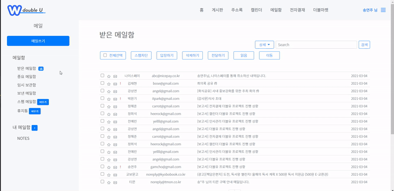

- 해당 체크박스를 클릭 후 읽음 버튼을 누르면 아이콘이 열려있는 아이콘을 변경된다. jQuery 토글 형식으로 구현했다.
 
### 2.6.1. 코드 링크
`view`
- [email_index.jsp](https://github.com/withColinSong/DoubleU/blob/main/doubleu/src/main/webapp/WEB-INF/jsp/email/email_index.jsp)
- [email_commons.js](https://github.com/withColinSong/DoubleU/blob/main/doubleu/src/main/resources/static/js/email/email_commons.js)
  - Ctrl+F -> `var favoritesBtn ` | `var changeChkReadBtn` | `var readBtn` 
- [email_main.css](https://github.com/withColinSong/DoubleU/blob/main/doubleu/src/main/resources/static/css/email/email_main.css)

`controller`
- [EmailMainController](https://github.com/withColinSong/DoubleU/blob/3690e8823b/doubleu/src/main/java/com/doubleu/email/contorller/EmailSelectController.java)
    - Ctrl+F -> `//email_index.jsp`

`vo`
- [EmailVo](https://github.com/withColinSong/DoubleU/blob/main/doubleu/src/main/java/com/doubleu/email/vo/EmailMainVo.java)

`business logic`
- [EmailDao `Dao`](https://github.com/withColinSong/DoubleU/blob/main/doubleu/src/main/java/com/doubleu/email/mybatis/EmailDao.java)
- [EmailMapper `Mapper`](https://github.com/withColinSong/DoubleU/blob/3690e8823b4bec1da302f558812bdfc57182ce21/doubleu/src/main/java/com/doubleu/email/mybatis/EmailMapper.java)
- [MyBatis `쿼리문`](https://github.com/withColinSong/DoubleU/blob/main/doubleu/src/main/resources/static/mapper/email_mapper.xml)

[목차로 이동하기](#목차)

## 2.7. 이동하기

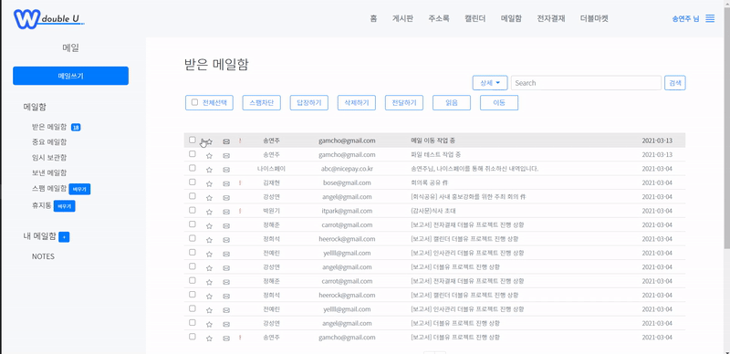
- 해당 체크박스를 클릭 후 이동 버튼을 누르면 DropDowns 방식으로 해당 메일함으로 이동할 수 있다.

### 2.7.1. 코드 링크

`view`
- [email_index.jsp](https://github.com/withColinSong/DoubleU/blob/main/doubleu/src/main/webapp/WEB-INF/jsp/email/email_index.jsp)
- [email_commonsButton](https://github.com/withColinSong/DoubleU/blob/main/doubleu/src/main/webapp/WEB-INF/jsp/email/commonsCode/selectAllDropDowns.jsp)
- [email_main.css](https://github.com/withColinSong/DoubleU/blob/main/doubleu/src/main/resources/static/css/email/email_main.css)

`controller`
- [EmailMainController](https://github.com/withColinSong/DoubleU/blob/3690e8823b/doubleu/src/main/java/com/doubleu/email/contorller/EmailSelectController.java)
    - Ctrl+F -> `//email_index.jsp`

`vo`
- [EmailVo](https://github.com/withColinSong/DoubleU/blob/main/doubleu/src/main/java/com/doubleu/email/vo/EmailMainVo.java)

`business logic`
- [EmailDao `Dao`](https://github.com/withColinSong/DoubleU/blob/main/doubleu/src/main/java/com/doubleu/email/mybatis/EmailDao.java)
- [SelectMoveFolderService](https://github.com/withColinSong/DoubleU/blob/3690e8823b/doubleu/src/main/java/com/doubleu/email/service/SelectMoveFolderService.java)
- [EmailMapper `Mapper`](https://github.com/withColinSong/DoubleU/blob/3690e8823b4bec1da302f558812bdfc57182ce21/doubleu/src/main/java/com/doubleu/email/mybatis/EmailMapper.java)
- [MyBatis `쿼리문`](https://github.com/withColinSong/DoubleU/blob/main/doubleu/src/main/resources/static/mapper/email_mapper.xml)

[목차로 이동하기](#목차)

> 중요 메일함을 제외한 나머지 메일함으로 제대로 이동하나 이동 후 받은 메일함 페이지로 이동 되는 것을 확인할 수 있다. 통일성이 필요하다!

## 2.8. 메일 쓰기

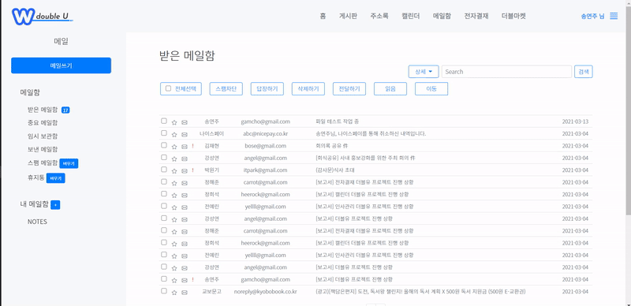

- 왼쪽 사이드바에서 메일 쓰기 버튼을 눌렀을 때 메일을 작성할 수 있다.
- `보내는 사람` : session의 저장된 멤버 정보를 기준으로 `이름`, `메일 주소`가 기본적으로 표시된다.
- `받는 사람`, `참조` : `추가` 버튼을 이용하여 개별적으로 메일 주소가 추가 가능하며, 주소록을 통해 팀별로도 저장이 가능하다.
- `중요!` : 체크박스를 클릭했을 시 중요 메일로 표시되어 메일함에 <code style="color:red">!</code>로 표현된다.
- `임시 저장` : 메일을 작성하다 임시 저장할 수 있다. 
- `내용` : Editor API를 사용했으며, 내용이 일정 height를 넘어가면 스크롤된다.
- `첨부파일` : 첨부 파일을 선택하면 해당 파일의 갯수만큼 span 태그가 추가되어 표시된다. 

### 2.8.1. 코드 링크
`view`
- [email_write.jsp](https://github.com/withColinSong/DoubleU/blob/main/doubleu/src/main/webapp/WEB-INF/jsp/email/email_write.jsp)
- [email_text.js `Editor API`](https://github.com/withColinSong/DoubleU/blob/main/doubleu/src/main/resources/static/js/email/email_text.js)
- [email_write.js](https://github.com/withColinSong/DoubleU/blob/main/doubleu/src/main/resources/static/js/email/email_write.js)
  - Ctrl+F -> `function sendToEmail()`
- [email_write.css](https://github.com/withColinSong/DoubleU/blob/main/doubleu/src/main/resources/static/css/email/email_write.css)
- [email_result.jsp `메일 전송 후 결과창`](https://github.com/withColinSong/DoubleU/blob/main/doubleu/src/main/java/com/doubleu/email/contorller/EmailMainController.java)

`controller`
- [emailResult](https://github.com/withColinSong/DoubleU/blob/main/doubleu/src/main/java/com/doubleu/email/contorller/EmailMainController.java)
  - Ctrl+F -> `// email_result.jsp`

`vo`
- [EmailVo](https://github.com/withColinSong/DoubleU/blob/main/doubleu/src/main/java/com/doubleu/email/vo/EmailMainVo.java)

`business logic`
- [EmailDao `Dao`](https://github.com/withColinSong/DoubleU/blob/main/doubleu/src/main/java/com/doubleu/email/mybatis/EmailDao.java)
- [EmailFileUpload Service](https://github.com/withColinSong/DoubleU/blob/3690e8823b4bec1da302f558812bdfc57182ce21/doubleu/src/main/java/com/doubleu/email/service/EmailUploadService.java#L17)
- [EmailReveiver Service](https://github.com/withColinSong/DoubleU/blob/3690e8823b/doubleu/src/main/java/com/doubleu/email/service/EmailReveiverService.java)
- [EmailMapper `Mapper`](https://github.com/withColinSong/DoubleU/blob/3690e8823b4bec1da302f558812bdfc57182ce21/doubleu/src/main/java/com/doubleu/email/mybatis/EmailMapper.java)
- [MyBatis `쿼리문`](https://github.com/withColinSong/DoubleU/blob/main/doubleu/src/main/resources/static/mapper/email_mapper.xml)

[목차로 이동하기](#목차)

## 2.9 임시 저장하기
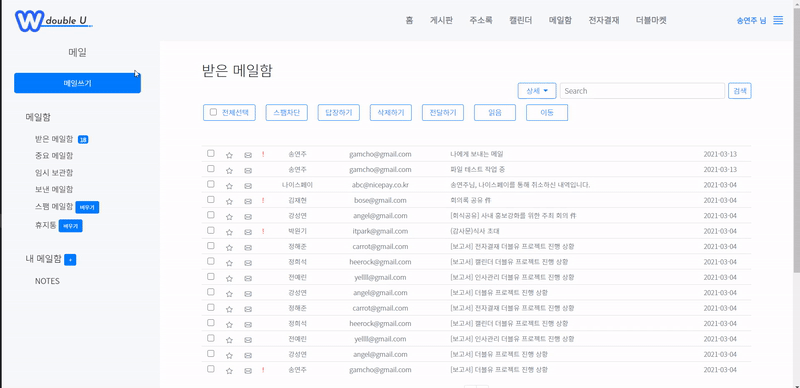

- 메일을 작성하다가 임시 저장 버튼을 눌렀을 시 임시 보관함에 저장된다.
- 제목이 없을 시 `제목없음`으로 저장된다.

### 2.9.1. 코드 링크 
`view`
- [email_temporaryModal.jsp](https://github.com/withColinSong/DoubleU/blob/main/doubleu/src/main/webapp/WEB-INF/jsp/email/modal/temporaryModal.jsp)
  - `임시 저장 버튼을 눌렀을 시 모달창`
- [email_temporary.jsp](https://github.com/withColinSong/DoubleU/blob/main/doubleu/src/main/webapp/WEB-INF/jsp/email/email_temporary.jsp)
  -  `임시 보관함`
- [email_temp.js](https://github.com/withColinSong/DoubleU/blob/main/doubleu/src/main/resources/static/js/email/email_temp.js)
- [email_main.css](https://github.com/withColinSong/DoubleU/blob/main/doubleu/src/main/resources/static/css/email/email_main.css)

`controller`
- [emailTemp](https://github.com/withColinSong/DoubleU/blob/main/doubleu/src/main/java/com/doubleu/email/contorller/EmailMainController.java)
  - Ctrl+F -> `// 임시저장`
- [emailTempRead](https://github.com/withColinSong/DoubleU/blob/main/doubleu/src/main/java/com/doubleu/email/contorller/EmailMainController.java)
  - Ctrl+F -> `// 임시 저장 읽기`
- [emailTempList](https://github.com/withColinSong/DoubleU/blob/main/doubleu/src/main/java/com/doubleu/email/contorller/EmailMainController.java)
  - Ctrl+F -> `// email_temporary.jsp`

`vo`
- [EmailVo](https://github.com/withColinSong/DoubleU/blob/main/doubleu/src/main/java/com/doubleu/email/vo/EmailMainVo.java)

`business logic`
- [EmailDao `Dao`](https://github.com/withColinSong/DoubleU/blob/main/doubleu/src/main/java/com/doubleu/email/mybatis/EmailDao.java)
- [EmailFileUpload Service](https://github.com/withColinSong/DoubleU/blob/3690e8823b4bec1da302f558812bdfc57182ce21/doubleu/src/main/java/com/doubleu/email/service/EmailUploadService.java#L17)
- [EmailReveiver Service](https://github.com/withColinSong/DoubleU/blob/3690e8823b/doubleu/src/main/java/com/doubleu/email/service/EmailReveiverService.java)
- [EmailMapper `Mapper`](https://github.com/withColinSong/DoubleU/blob/3690e8823b4bec1da302f558812bdfc57182ce21/doubleu/src/main/java/com/doubleu/email/mybatis/EmailMapper.java)
- [MyBatis `쿼리문`](https://github.com/withColinSong/DoubleU/blob/main/doubleu/src/main/resources/static/mapper/email_mapper.xml)

[목차로 이동하기](#목차)

## 2.10. 메일 읽기
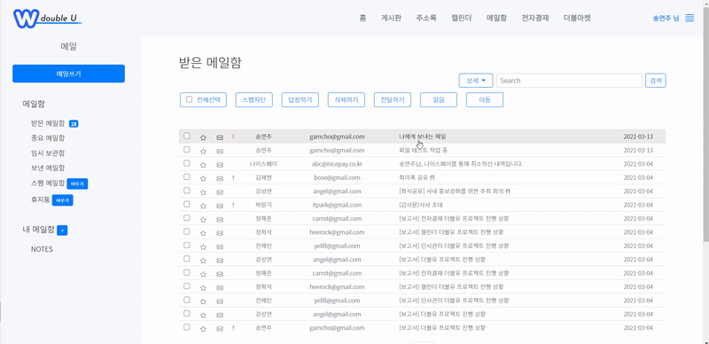

- 메일을 클릭하면 해당 메일에 대한 내용을 확인할 수 있다.
- 해당 메일을 클릭하면 스크립트 `goView(emailNo)` function을 통해 해당 하는 데이터를 조회한다.

### 2.10.1 코드 링크
`view`
- [email_read.jsp](https://github.com/withColinSong/DoubleU/blob/main/doubleu/src/main/webapp/WEB-INF/jsp/email/email_read.jsp)
- [email_commons.js](https://github.com/withColinSong/DoubleU/blob/main/doubleu/src/main/resources/static/js/email/email_commons.js)
- [email_read.css](https://github.com/withColinSong/DoubleU/blob/main/doubleu/src/main/resources/static/css/email/email_read.css)

`controller`
- [emailRead](https://github.com/withColinSong/DoubleU/blob/main/doubleu/src/main/java/com/doubleu/email/contorller/EmailMainController.java)
  - Ctrl+F -> `// email_read.jsp`

`vo`
- [EmailVo](https://github.com/withColinSong/DoubleU/blob/main/doubleu/src/main/java/com/doubleu/email/vo/EmailMainVo.java)

`business logic`
- [EmailDao `Dao`](https://github.com/withColinSong/DoubleU/blob/main/doubleu/src/main/java/com/doubleu/email/mybatis/EmailDao.java)
- [EmailFileUpload Service](https://github.com/withColinSong/DoubleU/blob/3690e8823b4bec1da302f558812bdfc57182ce21/doubleu/src/main/java/com/doubleu/email/service/EmailUploadService.java#L17)
- [EmailReveiver Service](https://github.com/withColinSong/DoubleU/blob/3690e8823b/doubleu/src/main/java/com/doubleu/email/service/EmailReveiverService.java)
- [EmailMapper `Mapper`](https://github.com/withColinSong/DoubleU/blob/3690e8823b4bec1da302f558812bdfc57182ce21/doubleu/src/main/java/com/doubleu/email/mybatis/EmailMapper.java)
- [MyBatis `쿼리문`](https://github.com/withColinSong/DoubleU/blob/main/doubleu/src/main/resources/static/mapper/email_mapper.xml)

[목차로 이동하기](#목차)

## 2.11. 주소록
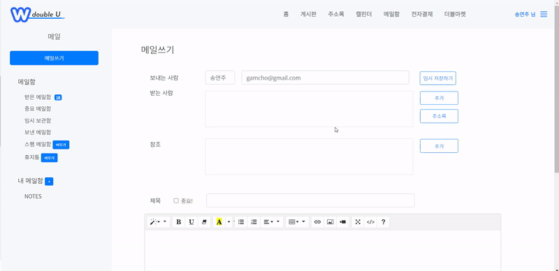
- 주소록 버튼을 눌렀을 때 해당 모달창에 직원의 이름, 메일주소, 부서를 불러온다.
- 체크 박스를 클릭 후 받은 사람의 가까운 `+`버튼을 눌렀을 시 해당 메일 주소가 append하여 `` 태그가 생성된다.
- 체크 박스를 클릭 후 참조에 가까운 `+`버튼을 눌렀을 시 해당 메일 주소가 append하여 `forEach`문을 통해 해당 memberNo만큼 ``태그가 생성된다.
- 검색바는 jQuery ajax를 이용하여 부서별로 조회가 가능하다.
- 주소록에서 추가하기 버튼을 눌렀을 시, 해당 메일 주소를 `input`태그에 append하였고, setAttribute를 통해 css와 태그 name을 추가해주었다. 해당 네임으로 INSERT가 가능하도록 만들었다.

### 2.11.1 코드 링크
`view`
- [email_addressModal.jsp](https://github.com/withColinSong/DoubleU/blob/main/doubleu/src/main/webapp/WEB-INF/jsp/email/modal/addressBookModal.jsp)
- [email_address.js](https://github.com/withColinSong/DoubleU/blob/main/doubleu/src/main/resources/static/js/email/email_addressBook.js)
 
`controller`
- [selectAddress](https://github.com/withColinSong/DoubleU/blob/main/doubleu/src/main/java/com/doubleu/email/contorller/EmailSelectController.java)
  - 주소록 클릭 시 직원의 데이터를 받아오는 컨트롤러
  - Ctrl+F -> `//주소록 조회하기`

`vo`
- [EmailVo](https://github.com/withColinSong/DoubleU/blob/main/doubleu/src/main/java/com/doubleu/email/vo/EmailMainVo.java)

`business logic`
- [EmailMapper `Mapper`](https://github.com/withColinSong/DoubleU/blob/3690e8823b4bec1da302f558812bdfc57182ce21/doubleu/src/main/java/com/doubleu/email/mybatis/EmailMapper.java)
- [MyBatis `쿼리문`](https://github.com/withColinSong/DoubleU/blob/main/doubleu/src/main/resources/static/mapper/email_mapper.xml)

[목차로 이동하기](#목차)

## 2.12. 로그인/로그아웃

- member 테이블의 데이터가 일치하지 않을 시에 `alert`창을 띄어 재로그인 하도록 만들었다.
  - `alert`창은 SweetAlert을 기본으로 사용하였으나 해당 프로젝트의 색감과 일치하도록 css를 수정하여 적용하였다.
  - [SweetAlert 사이트](https://sweetalert.js.org/guides/)
- 로그인 성공 시 `HttpSession`에 해당 멤버의 데이터를 저장한다.
- 로그아웃 시 해당 세션을 `invalidate()` 초기화한다.

### 2.12.1 코드 링크

`view`
- [login.jsp](https://github.com/withColinSong/DoubleU/blob/main/doubleu/src/main/webapp/WEB-INF/jsp/MainPage/login.jsp)
- [loginPost.jsp `로그인 실패 view 와 스크립트`](https://github.com/withColinSong/DoubleU/blob/main/doubleu/src/main/webapp/WEB-INF/jsp/MainPage/loginPost.jsp)
- [login.js `아이디/비밀번호을 입력하지 않았을 때 스크립트`](https://github.com/withColinSong/DoubleU/blob/main/doubleu/src/main/resources/static/js/login/login.js) 
- [login.css](https://github.com/withColinSong/DoubleU/blob/main/doubleu/src/main/resources/static/css/email/login.css)

`controller`
- [LoginURLController](https://github.com/withColinSong/DoubleU/blob/main/doubleu/src/main/java/com/doubleu/login/controller/loginURLController.java)
- [LoginMainController](https://github.com/withColinSong/DoubleU/blob/main/doubleu/src/main/java/com/doubleu/login/controller/loginMainController.java)

`vo`
- [LoginVo](https://github.com/withColinSong/DoubleU/blob/main/doubleu/src/main/java/com/doubleu/login/vo/LoginVo.java)

`business logic`
- [LoginDao `Dao`](https://github.com/withColinSong/DoubleU/blob/main/doubleu/src/main/java/com/doubleu/login/mybatis/LoginDao.java)
- [LoginService `Service`](https://github.com/withColinSong/DoubleU/blob/main/doubleu/src/main/java/com/doubleu/login/service/LoginService.java)
- [LoginMapper `Mapper`](https://github.com/withColinSong/DoubleU/blob/main/doubleu/src/main/java/com/doubleu/login/mybatis/LoginMapper.java)
- [MyBatis `쿼리문`](https://github.com/withColinSong/DoubleU/blob/main/doubleu/src/main/resources/static/mapper/login_mapper.xml)

[목차로 이동하기](#목차)

# 3. 프로젝트 후기
스프링을 배우면서 파이널 프로젝트를 같이 하는 것이 부담감과 걱정이 들었지만, WEB-INF 안에 있는 폴더와 Controller를 통해 URL 연결을 시작으로 하나씩 해결하려고 노력했다. 이번 프로젝트에서는 세미 프로젝트 때 작성하지 않았던 회의록도 작성하였다. 또한 세미 프로젝트 때에 구현했던 회원가입 테이블은 하나로 충분했는데, 파이널 프로젝트 때 맡았던 메일함 구현 테이블에서는 테이블을 3개씩 조인을 하여 사용하였기에 어려웠지만 DML, DDL에 좀 더 익숙하게 만들었다. 그리고 부트스트랩 프레임워크를 처음으로 사용하였다. 기능 구현이 막힐 때엔 방향성을 찾느라 고생을 많이 했지만, 차분히 생각하여 기능 구현이 됐을 때의 기쁨이 코딩의 매력인 것 같다.

## 3.1. 앞으로의 방향성
1. 설계단계에서 테이블 등 구체적으로 설계할 것. (컨트롤러, 변수명, 파일명, 기능 등)
2. 불필요한 코드 주석처리 대신 삭제하기
3. js, css파일을 완벽하게 분리하여 작성하기

- [📁 포트폴리오 메인으로 이동하기](https://github.com/withColinSong/Portfolio)
- [목차로 이동하기](#목차)