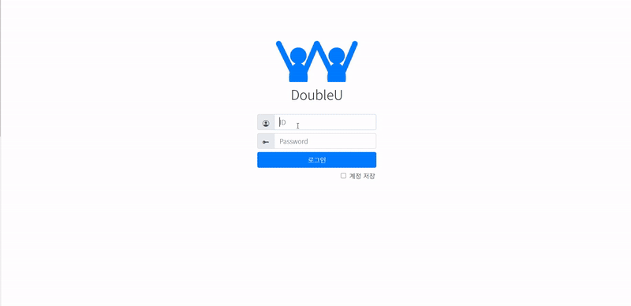

## 🔍 `Semi Project` Preview

> `아래 링크에서 자세한 내용이 확인 가능합니다.`  
- [📁 자세한 내용으로 이동하기](SemiProject/README.md)

## 🔍 `Final Project` Preview

> `아래 링크에서 자세한 내용이 확인 가능합니다.`  
- [📁 자세한 내용으로 이동하기](FinalProject/README.md)

## 🔍 `프로젝트 협업` Repository
- [📁 1. FineApple 프로젝트 협업 폴더](https://github.com/withColinSong/FineApple)
  - [📁 1.1 세미 프로젝트 작업 진행 시 개인적으로 메모했던 폴더](https://github.com/withColinSong/Semi-Project/tree/master/01.plan)
- [📁 2. DoubleU 프로젝트 협업 폴더](https://github.com/withColinSong/DoubleU)
  - [📁 2.1 파이널 프로젝트 작업 진행 시 개인적으로 메모했던 폴더](https://github.com/withColinSong/Final-Project/tree/main/04.record)
