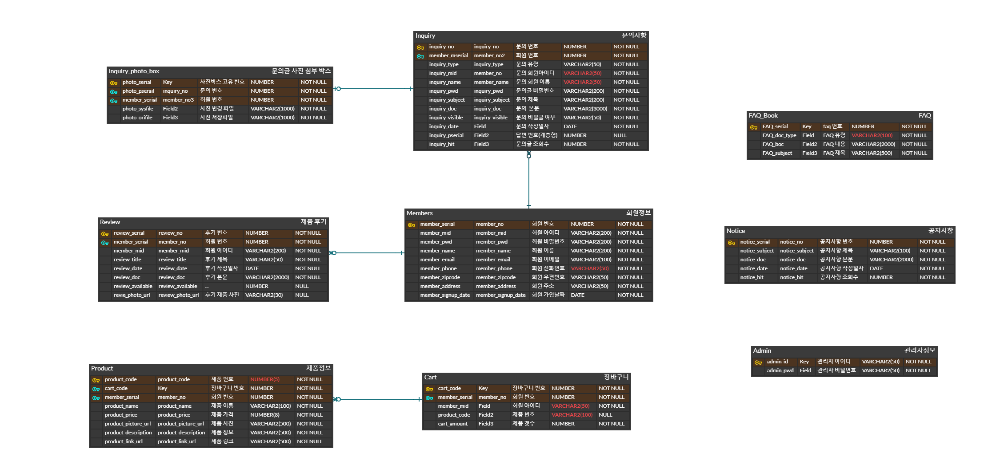
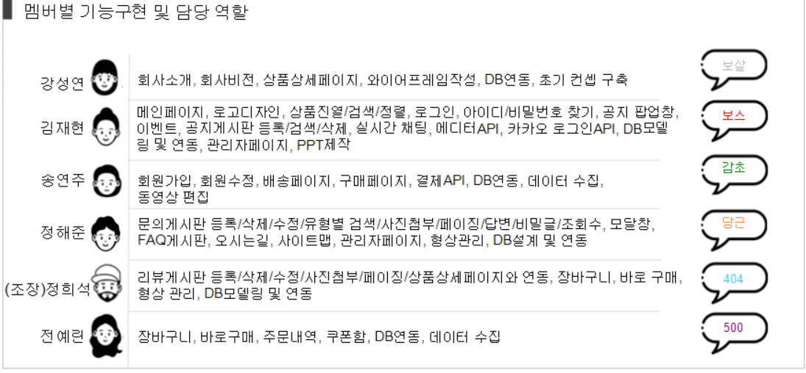
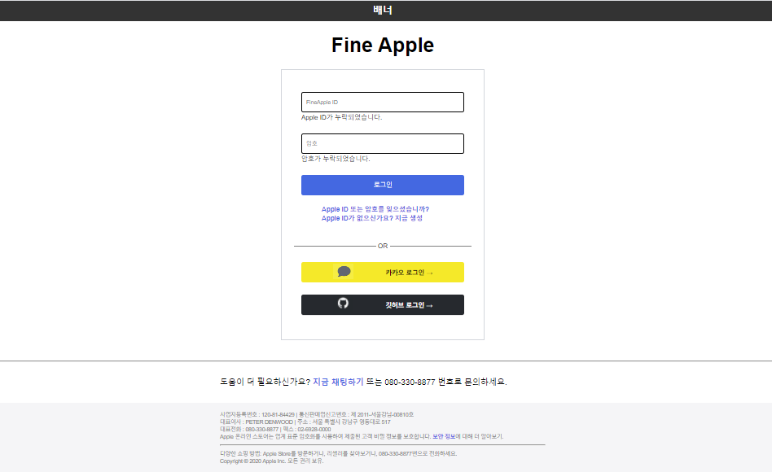
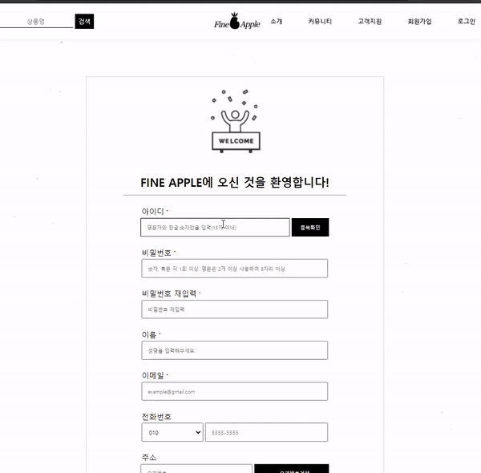
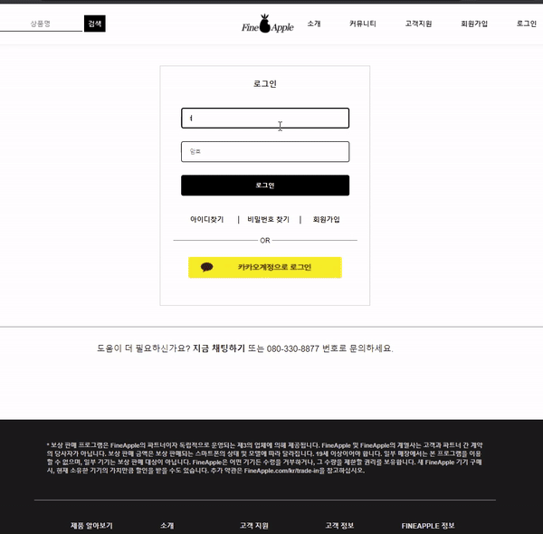
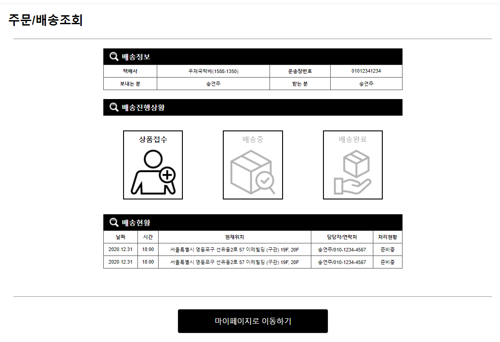
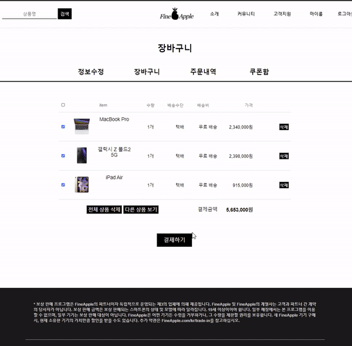
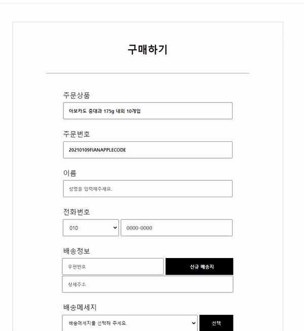
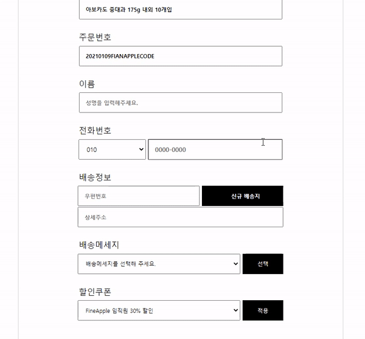

# 목차
- [목차](#목차)
- [1. 프로젝트 소개](#1-프로젝트-소개)
  - [1.1. 프로젝트 명](#11-프로젝트-명)
  - [1.2. 주제 선정 이유](#12-주제-선정-이유)
  - [1.3. 프로젝트 목표](#13-프로젝트-목표)
  - [1.4. 수행기간](#14-수행기간)
  - [1.5. 사용 기술](#15-사용-기술)
  - [1.4. ERD](#14-erd)
  - [1.5. 멤버별 기능 구현](#15-멤버별-기능-구현)
  - [1.6. 담당 역할](#16-담당-역할)
- [2. 기능 구현 상세 설명](#2-기능-구현-상세-설명)
  - [2.1. 로그인 화면 구상하여 만들어보기](#21-로그인-화면-구상하여-만들어보기)
    - [2.1.1. 코드 링크](#211-코드-링크)
      - [2.1.1.1 보안점](#2111-보안점)
    - [2.1.2 로그인 화면 구상 중 메모 작성](#212-로그인-화면-구상-중-메모-작성)
  - [2.2. 회원가입 서비스 약관](#22-회원가입-서비스-약관)
    - [2.2.1 코드 링크](#221-코드-링크)
  - [2.3. 회원가입](#23-회원가입)
    - [2.3.1. 코드 링크](#231-코드-링크)
  - [2.4. 회원정보 수정](#24-회원정보-수정)
    - [2.4.1. 코드 링크](#241-코드-링크)
  - [2.5. 주문/배송조회 프론트 작업](#25-주문배송조회-프론트-작업)
    - [2.5.1. 코드 링크](#251-코드-링크)
  - [2.6. 구매하기](#26-구매하기)
    - [2.6.1 코드 링크](#261-코드-링크)
  - [2.7. 결제하기](#27-결제하기)
    - [2.7.1 코드 링크](#271-코드-링크)
  - [🎉 후기](#-후기)

# 1. 프로젝트 소개

## 1.1. 프로젝트 명
- `FineApple`

[목차로 이동하기](#목차)
## 1.2. 주제 선정 이유

배운 것을 기반으로 지식을 확장시켜 나갈 수 있는 게 무엇일까 고민을 해봤다. 팀원들의 여러 의견들 중에 쇼핑몰이 레이아웃 작업을 포함하여 게시판 기능 등 다양한 기능을 가지고 있어 선정하게 되었다.

- 참고 사이트 : `Apple 홈페이지`

[목차로 이동하기](#목차)

## 1.3. 프로젝트 목표
- 다양한 기능을 갖춘 전자 제품 브랜드 사이트 구축

[목차로 이동하기](#목차)

## 1.4. 수행기간
- 2020년 12월 05일 ~ 2021년 01월 12일

[목차로 이동하기](#목차)

## 1.5. 사용 기술 

구분|종류|적용부분
|:-:|:-:|:-:|
Language|Java|공통|
DBMS|Oracle11g|공통|
Frontend| HTML, CSS, JavaScript, JSP/Servlet|공통|
Library|jQuery, OJDBC, JSTL, COS|공통|
Framework|MyBatis|공통|
Server| Apache Tomcat 9.0| 공통
형상관리|GitHub, SourceTree|
IDE | Eclipse, Sql Developer, VSC|

[목차로 이동하기](#목차)

## 1.4. ERD 

[목차로 이동하기](#목차)

## 1.5. 멤버별 기능 구현
> 프로젝트 인원 : 6명

- 회원관리
- 결제하기
- 리뷰 게시판
- Q/A 게시판
- 장바구니
- 관리자 페이지

[목차로 이동하기](#목차)

## 1.6. 담당 역할
- 회원가입 : `회원가입` , `회원정보 수정`
- 구매하기 : `임직원 할인 10% 쿠폰 등록 처리`
- 결제하기 : 아임포트를 이용하여 `토스 신용카드 결제/무통장 입금  API` 구현
- 배송페이지 : 프론트 작업

[목차로 이동하기](#목차)

# 2. 기능 구현 상세 설명

## 2.1. 로그인 화면 구상하여 만들어보기
기능 구현을 나누기 전에 로그인 부분과 푸터를 구상해보고 실제 프론트 작업을 통해 데모 파일 작성했다.

### 2.1.1. 코드 링크
- [index.html 파일](https://github.com/withColinSong/Semi-Project/blob/master/01.plan/01.Song/code/20.12/201206/index.html)
- [index.css 파일](https://github.com/withColinSong/Semi-Project/blob/master/01.plan/01.Song/code/20.12/201206/index.css)

#### 2.1.1.1 보안점
1. CSS를 적용할 때, 태그에 직접 지정하는 것이 아니라 `name`이나, `class`로 지정하여 적용하는 것이 팀원들과 코드를 합쳤을 때 충돌이 없다.

### 2.1.2 로그인 화면 구상 중 메모 작성
> 작성일 : 20.12.09
- 로그인 화면
- 화면 구성
- 회원가입 페이지

> 참고사이트
>  
>[Apple 회원가입 사이트](https://appleid.apple.com/account?localang=KP-KO&app_id=2083&returnURL=https%3A//secure2.store.apple.com/kr/shop/sign_in%3Fc%3DaHR0cHM6Ly93d3cuYXBwbGUuY29tL2tyL3Nob3AvYmFnfDFhb3MzMDQyM2E5M2JmNGU5YzVlYTBiYzY3MTNjN2FiZjQwZThiYzE5ODhk%26r%3DSCDHYHP7CY4H9XK2H%26s%3DaHR0cHM6Ly93d3cuYXBwbGUuY29tL2tyL3Nob3AvYmFnfDFhb3MzMDQyM2E5M2JmNGU5YzVlYTBiYzY3MTNjN2FiZjQwZThiYzE5ODhk) 애플회원 가입도 깔끔함.
>
>[무신사 회원가입](https://my.musinsa.com/member/v2/join)    
    
    
    - 참고사항 : 단순하게, 이메일만 입력했을 시 가입하기도 있다.

1. class명, id명은 어떻게 해야할 지도 고민해보자.
2. 부족한 부분 생각해보기

[목차로 이동하기](#목차)

## 2.2. 회원가입 서비스 약관

- `[필수]` 항목을 선택하지 않았을 때 JavaScript을 이용하여 alert창을 띄어주며 다음으로 넘어가지 않도록 스크립트 처리하였다.
- 계정 약관 `>` 버튼을 눌렀을 시 스크립트 모달창을 띄워 약관을 보여준다.

### 2.2.1 코드 링크
`view`
- [agree.jsp](https://github.com/withColinSong/FineApple/blob/main/Fineapple-final/WebContent/UsersJoin/agree.jsp)
- [modal.js](https://github.com/withColinSong/FineApple/blob/main/Fineapple-final/WebContent/js/userjoin/agree.js)
- [agree.css](https://github.com/withColinSong/FineApple/blob/main/Fineapple-final/WebContent/css/UsersJoin/agree.css)

[목차로 이동하기](#목차)

## 2.3. 회원가입

- 아이디를 중복체크 시 서블릿으로 DataBase를 처리 후 JSP를 통해 해당 아이디가 null 이라면 `스마일 표시`, null이 아니라면 `중복` 표시가 된다.
- JavaScript를 이용하여 이메일, 비밀번호, 아이디 형식을 벗어날 시 정규식 유효성 체크
- Daum 우편 API를 사용하여 스크립트 처리 후 해당 `<input>` 태그에 데이터를 넣어준다.

### 2.3.1. 코드 링크
`view`
- [userjoinIndex.jsp](https://github.com/withColinSong/FineApple/blob/main/Fineapple-final/WebContent/UsersJoin/index.jsp)
- [userjoin.js](https://github.com/withColinSong/FineApple/blob/main/Fineapple-final/WebContent/js/userjoin/userjoin.js)
- [userjoin.css](https://github.com/withColinSong/FineApple/blob/main/Fineapple-final/WebContent/css/UsersJoin/UsersJoin.css)

`controller`
- [MemberServlet](https://github.com/withColinSong/FineApple/blob/main/Fineapple-final/src/users/MemberServlet.java)

`vo`
- [MemberVo](https://github.com/withColinSong/FineApple/blob/main/Fineapple-final/src/users/MemberVo.java)
 
`myBatis`
- [BoardFactory.java `sqlSessionFactory`](https://github.com/withColinSong/FineApple/blob/main/Fineapple-final/src/users/BoardFactory.java)
- [BoardDao.java `sqlSession`](https://github.com/withColinSong/FineApple/blob/main/Fineapple-final/src/users/BoardDao.java)
- [config.xml `connection`](https://github.com/withColinSong/FineApple/blob/main/Fineapple-final/src/users/config.xml)
- [board.xml `쿼리문`](https://github.com/withColinSong/FineApple/blob/main/Fineapple-final/src/users/board.xml)
 
[목차로 이동하기](#목차)

## 2.4. 회원정보 수정

- 가입한 아이디로 로그인 후 마이룸 -> 회원정보 수정으로 이동하면 가입했을 때 정보를 가져오며, `현재 비밀번호`와 `새로운 비밀번호`가 다를 시 alert창 띄우고 스크립트 처리한다.
- 아이디를 제외한 나머지를 수정할 수 있다.
- 수정하기 버튼을 눌렀을 시 해당 데이터가 Servlet을 이용하여 DataBase를 통해 update 되면서 바뀐다.

### 2.4.1. 코드 링크
`view`
- [mypage.jsp](https://github.com/withColinSong/FineApple/blob/main/Fineapple-final/WebContent/mypage/mypage.jsp)
- [mypage.js](https://github.com/withColinSong/FineApple/blob/main/Fineapple-final/WebContent/js/userjoin/mypage.js)
- [mypage.css](https://github.com/withColinSong/FineApple/blob/main/Fineapple-final/WebContent/css/UsersJoin/mypage.css)

`controll`
- [userProfileServlet](https://github.com/withColinSong/FineApple/blob/main/Fineapple-final/src/users/userProfileServlet.java)

`vo`
- [MemberVo](https://github.com/withColinSong/FineApple/blob/main/Fineapple-final/src/users/MemberVo.java)
 
`myBatis`
- [BoardFactory.java `sqlSessionFactory`](https://github.com/withColinSong/FineApple/blob/main/Fineapple-final/src/users/BoardFactory.java)
- [BoardDao.java `sqlSession`](https://github.com/withColinSong/FineApple/blob/main/Fineapple-final/src/users/BoardDao.java)
- [config.xml `connection`](https://github.com/withColinSong/FineApple/blob/main/Fineapple-final/src/users/config.xml)
- [board.xml `쿼리문`](https://github.com/withColinSong/FineApple/blob/main/Fineapple-final/src/users/board.xml)

[목차로 이동하기](#목차)

## 2.5. 주문/배송조회 프론트 작업

- [icon 참고 사이트](https://iconmonstr.com/party-12-svg/)

- `배송 현황` / `배송 정보` HTML Table을 이용하여 작성했다.
- `배송 진행 상황` flex 박스를 이용하여 레이아웃 작업 후 css 처리했다.

### 2.5.1. 코드 링크
`view`
- [trackingIndex.jsp](https://github.com/withColinSong/FineApple/blob/main/Fineapple-final/WebContent/Tracking/index.jsp)
- [tracking.css](https://github.com/withColinSong/FineApple/blob/main/Fineapple-final/WebContent/css/tracking/tracking.css)

[목차로 이동하기](#목차)

## 2.6. 구매하기

- 장바구니에서 `구매하기`를 눌렀을 시 해당 아이템들의 갯수만큼 `<input>` 태그를 JSP에서 JSTL `<c:forEach><//forEach>`을 이용하여 추가했다.
- `10% 할인쿠폰 적용`
  - 해당 select의 option 값을 가져온다. 
  - 적용하기 버튼을 `onClick` 시에 장바구니에서 넘어온 총 금액을 JSTL 을 이용하여 자바스크립트 변수에  `var name = ${sum}` 담아준다. 그 변수를 `typeOf`-> `parseInt`을 통해 형변환 후 `*0.1`의 연산식을 끝낸 후 jQuery를 이용하여 .attr 속성을 이용하여 데이터를 담아준다.

### 2.6.1 코드 링크
`view`
- [purchaseIndex.jsp](https://github.com/withColinSong/FineApple/blob/main/Fineapple-final/WebContent/purchase/index.jsp)
- [purchase.css](https://github.com/withColinSong/FineApple/blob/main/Fineapple-final/WebContent/css/purchase/purchase.css)

`controller`
- [purchaseServlet](https://github.com/withColinSong/FineApple/blob/main/Fineapple-final/src/users/purchaseServlet.java)

`vo`
- [MemberVo](https://github.com/withColinSong/FineApple/blob/main/Fineapple-final/src/users/MemberVo.java)
 
`myBatis`
- [BoardFactory.java `sqlSessionFactory`](https://github.com/withColinSong/FineApple/blob/main/Fineapple-final/src/users/BoardFactory.java)
- [BoardDao.java `sqlSession`](https://github.com/withColinSong/FineApple/blob/main/Fineapple-final/src/users/BoardDao.java)
- [config.xml `connection`](https://github.com/withColinSong/FineApple/blob/main/Fineapple-final/src/users/config.xml)
- [board.xml `쿼리문`](https://github.com/withColinSong/FineApple/blob/main/Fineapple-final/src/users/board.xml)

[목차로 이동하기](#목차)

## 2.7. 결제하기
- `아임포트`를 이용하여 toss 신용카드 결제/무통장 입금 API를 구현했다.
- 토스 신용카드 결제/무통장 입금 API를 사용했다.

### 2.7.1 코드 링크
`view`
- [paying.jsp로 이동하기](https://github.com/withColinSong/FineApple/blob/main/Fineapple-final/WebContent/purchase/paying.jsp)
- [paying.css로 이동하기](https://github.com/withColinSong/FineApple/blob/main/Fineapple-final/WebContent/css/purchase/paying.css)
- [payComplete.jsp로 이동하기](https://github.com/withColinSong/FineApple/blob/main/Fineapple-final/WebContent/purchase/payComplete.jsp)
- [payComplete.css로 이동하기](https://github.com/withColinSong/FineApple/blob/main/Fineapple-final/WebContent/css/purchase/payComplete.css)

[목차로 이동하기](#목차)

## 🎉 후기

- [📁 포트폴리오 메인으로 이동하기](https://github.com/withColinSong/Portfolio)
- [목차로 이동하기](#목차)

